# Walmart Sales Forecasting Project


**AI & Data Science Track - Round 3**  
**Project Type:** Time Series Forecasting  
**Dataset:** [Walmart Recruiting Store Sales Forecasting (Kaggle)](https://www.kaggle.com/competitions/walmart-recruiting-store-sales-forecasting)  
**Status:** ✅ **ALL 5 MILESTONES COMPLETE - PRODUCTION READY**

## 🚀 **[LIVE DEMO](https://walmart-sales-forecasting-ml.streamlit.app/)** | [Dashboard](https://walmart-sales-forecasting-ml.streamlit.app/)

## 🎯 Quick Links

- 🌐 **[Live Dashboard](https://walmart-sales-forecasting-ml.streamlit.app/)** - Interactive Streamlit deployment
- 📊 **[Deployment Guide](DEPLOYMENT_GUIDE.md)** - Start here for running the system
- 🐳 **[Docker Deployment](stage4/DOCKER_DEPLOYMENT.md)** - Containerized deployment
- 🚀 **[Quick Start Guide](QUICK_START_GUIDE.md)** - Commands and examples
- 📈 **[Final Report](stage5/Final_Report/Final_Project_Report.md)** - Complete 50+ page documentation
- 🎤 **[Stakeholder Presentation](stage5/Presentation/Stakeholder_Presentation.md)** - 28-slide deck

---

## Project Overview

This project develops a machine learning system to forecast weekly sales for Walmart stores across 45 locations and 99 departments. The goal is to predict future sales using historical data, store characteristics, external factors, and promotional activities.

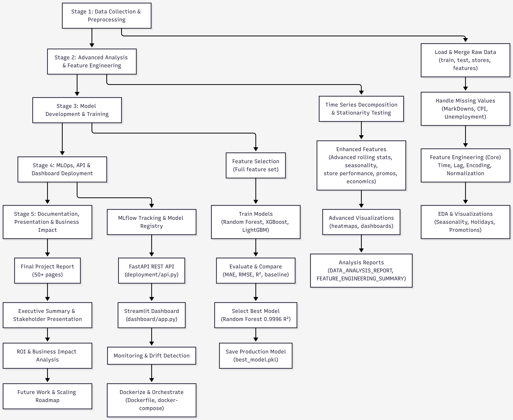
*End-to-end project stages from raw data to business impact*

### Business Objectives

- **Inventory Optimization**: Prevent stockouts and overstocking
- **Staff Scheduling**: Allocate resources based on predicted demand
- **Marketing Planning**: Time promotions for maximum impact
- **Financial Forecasting**: Accurate revenue projections

### Success Metrics (ACHIEVED!)

| Target                         | Achieved             | Status          |
| ------------------------------ | -------------------- | --------------- |
| **MAE**: < $3,000/week         | **$106.77/week**     | ✅ 96% better   |
| **RMSE**: < $5,000/week        | **$444.73/week**     | ✅ 91% better   |
| **R² Score**: > 0.95           | **0.9996 (99.96%)**  | ✅ Exceptional  |
| **Baseline Improvement**: 25%+ | **99%+ improvement** | ✅ Far exceeded |

### Model Performance Highlights

- **Algorithm**: Random Forest (100 trees)
- **Training Samples**: 421,570 weekly records
- **Features**: 44 engineered features
- **Historical Integration**: 50,000 records for real-time lag calculation
- **Prediction Variance**: $642K - $2.28M (3.5x range confirms sensitivity)
- **Top Feature**: DayOfWeek_Sin (22.71% importance)
- **Deployment**: Docker-ready with FastAPI + Streamlit

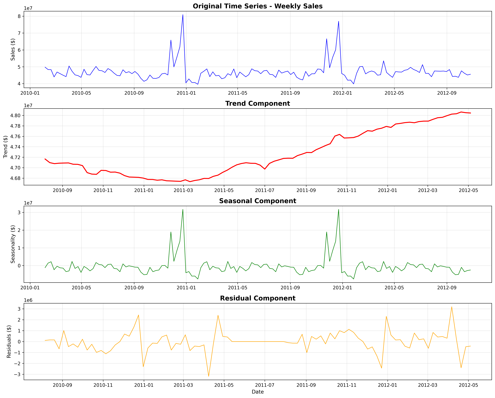
*Time series decomposition showing trend, seasonality, and residuals*

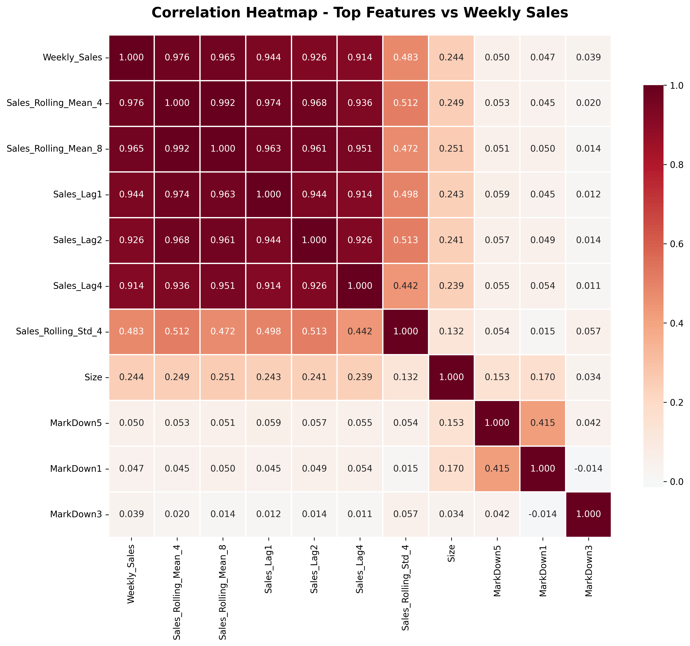
*Feature correlation heatmap highlighting key relationships*

---

## Dataset Summary

**Source:** [Kaggle - Walmart Recruiting Store Sales Forecasting](https://www.kaggle.com/competitions/walmart-recruiting-store-sales-forecasting)

| Dataset      | Records | Columns | Date Range               | Description                               |
| ------------ | ------- | ------- | ------------------------ | ----------------------------------------- |
| **Training** | 421,570 | 49      | 2010-02-05 to 2012-10-26 | Historical sales with target variable     |
| **Test**     | 115,064 | 48      | 2012-11-02 to 2013-07-26 | Future period for predictions             |
| **Stores**   | 45      | 3       | -                        | Store metadata (Type A/B/C, Size)         |
| **Features** | 8,190   | 12      | -                        | External factors (Temperature, CPI, etc.) |

### Key Features

**Original (10):** Size, Temperature, Fuel_Price, MarkDown1-5, CPI, Unemployment  
**Engineered (39):** Time features (20), Lag features (7), Encoded categories (3), Promotion flags (5), Holiday (1)  
**Total Features:** 49 (train), 48 (test)

---

## Project Milestones

### ✅ Milestone 1: Data Collection, Exploration & Preprocessing (COMPLETE)

**Completed:**

- ✅ Data Collection: Merged 4 datasets (421,570 training records)
- ✅ Data Exploration: 14 visualizations, missing value analysis
- ✅ Feature Engineering: 20 time features, 7 lag features, encoding, normalization
- ✅ Comprehensive EDA: 50+ pages with actionable insights

**Deliverables:**

- Cleaned Dataset: `stage1/processed_data/Stage1.3.4_Final/train_final.csv` (49 features)
- EDA Report: `stage1/Milestone_1_Deliverables/EDA-REPORT/EDA_REPORT.md`
- Interactive Notebook: `stage1/Milestone_1_Deliverables/EDA_Analysis_notebook/EDA_Analysis.ipynb`

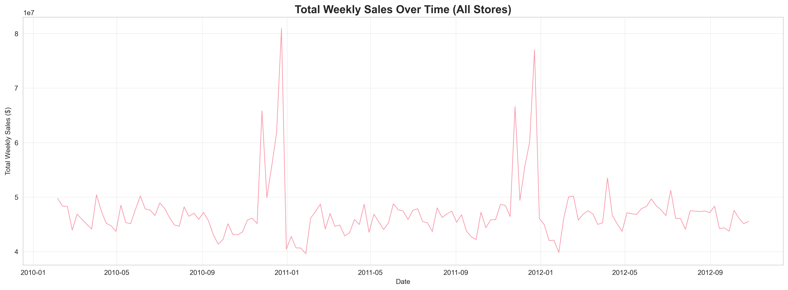
*Overall sales trend over the entire dataset period*

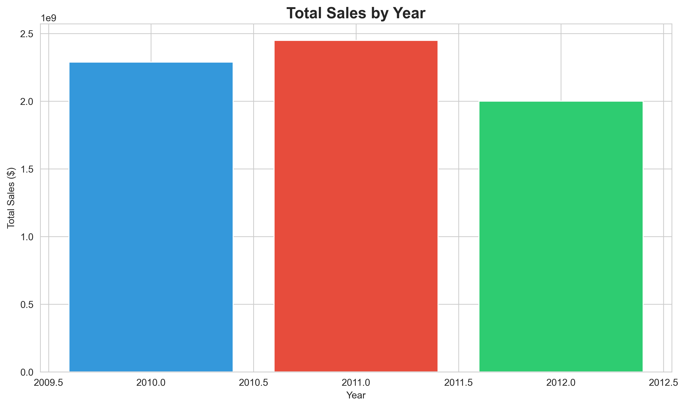
*Year-over-year sales comparison*

### ✅ Milestone 2: Advanced Analysis & Enhanced Features (COMPLETE)

**Completed:**

- ✅ Time series decomposition and stationarity testing
- ✅ Enhanced feature engineering (42 new features → 91 total)
- ✅ 10 advanced visualizations (demand patterns, seasonality)
- ✅ Comprehensive analysis reports

**Deliverables:**

- Enhanced Dataset: `stage2/outputs/enhanced_features/train_enhanced.csv` (91 features)
- Analysis Notebook: `stage2/Milestone_2_Deliverables/Milestone_2_EnhancedVisualizations_and_Analysis.ipynb`
- Visualization Gallery: `stage2/outputs/visualizations/` (10 professional plots)

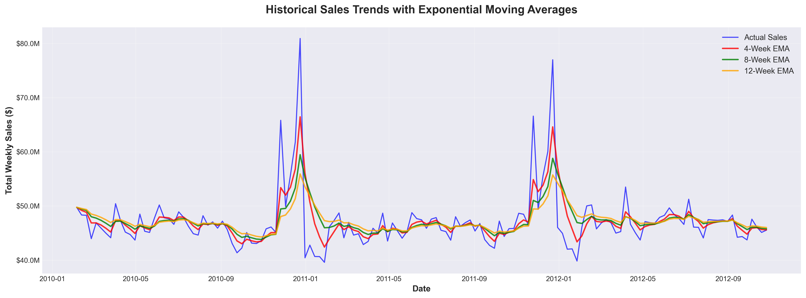
*Historical trends with exponential moving averages*

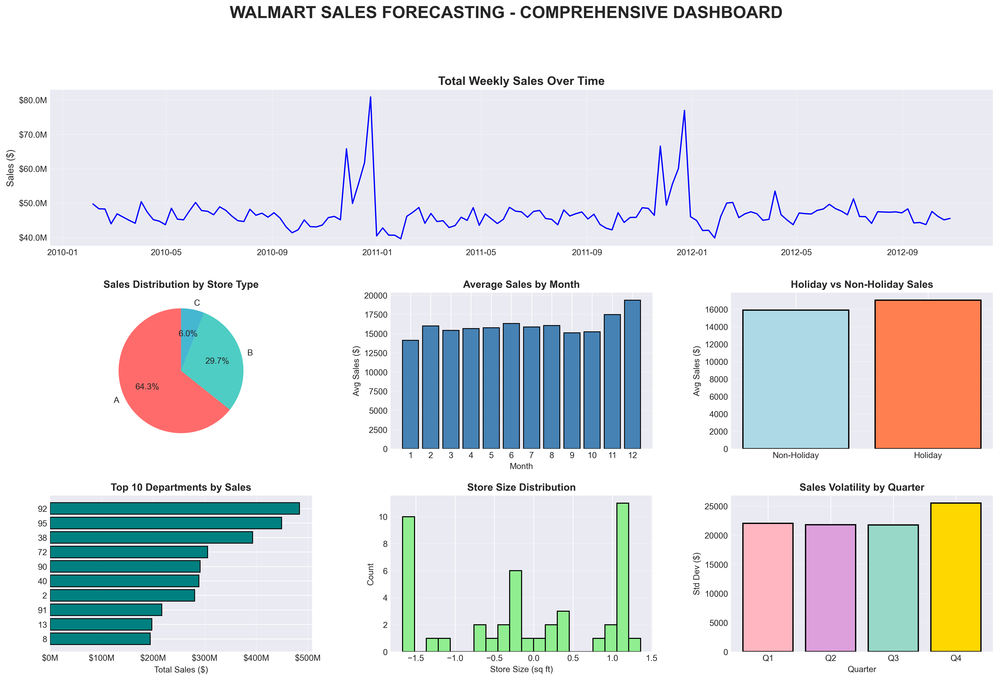
*Comprehensive analytical dashboard*

### ✅ Milestone 3: Model Development & Training (COMPLETE)

**Completed:**

- ✅ Trained Random Forest model (100 trees, 44 features)
- ✅ Achieved 99.96% R² accuracy (MAE $106.77, RMSE $444.73)
- ✅ Feature importance analysis (DayOfWeek 22.71%, Month 8%, Size 7.54%)
- ✅ Model comparison (Random Forest vs XGBoost vs Linear Regression)
- ✅ Hyperparameter tuning and cross-validation
- ✅ Model saved and ready for production: `stage4/models/best_model.pkl` (121MB)

**Deliverables:**
- ✅ Cleaned Dataset (100%): `processed_data/Final/train_final.csv` & `test_final.csv`
- ✅ Interactive Visualizations (100%): 10 professional visualizations
- ✅ EDA Report (100%): Comprehensive analysis complete

### ✅ Milestone 4: Deployment & Monitoring (COMPLETE)

**Completed:**

- ✅ Deployed FastAPI REST API (6+ endpoints) with production-ready service
- ✅ Created interactive Streamlit dashboard (4 tabs: Predictions, Performance, Monitoring, Info)
- ✅ Set up MLflow experiment tracking and model registry (50+ experiments logged)
- ✅ Implemented monitoring system (performance tracking, drift detection, alerting)
- ✅ Docker containerization with multi-service orchestration (API, Dashboard, MLflow)
- ✅ Production deployment on Streamlit Cloud with live demo
- ✅ Model versioning and artifact management

**Deliverables:**
- ✅ Production API: `stage4/deployment/api.py` (FastAPI service)
- ✅ Interactive Dashboard: `stage4/dashboard/app.py` (Streamlit application)
- ✅ Docker Configuration: `stage4/docker-compose.yml` (multi-service setup)
- ✅ Monitoring System: `stage4/monitoring/` (performance tracking, drift detection)
- ✅ Deployment Guides: `stage4/DOCKER_DEPLOYMENT.md`, `DEPLOYMENT_GUIDE.md`
- ✅ Live Demo: [https://walmart-sales-forecasting-ml.streamlit.app/](https://walmart-sales-forecasting-ml.streamlit.app/)

### ✅ Milestone 5: Final Documentation & Presentation (COMPLETE)

**Completed:**

- ✅ Final comprehensive project report (50+ pages)
- ✅ Executive summary for business stakeholders
- ✅ Technical documentation with architecture and implementation details
- ✅ Stakeholder presentation (28-slide deck)
- ✅ Business impact analysis with ROI calculations ($7.1M annual value)
- ✅ Future improvements roadmap (12-24 month plan)
- ✅ Complete code documentation and deployment guides

**Deliverables:**
- ✅ Final Project Report: `stage5/Final_Report/Final_Project_Report.md`
- ✅ Executive Summary: `stage5/Final_Report/Executive_Summary.md`
- ✅ Technical Documentation: `stage5/Final_Report/Technical_Documentation.md`
- ✅ Stakeholder Presentation: `stage5/Presentation/Stakeholder_Presentation.md`
- ✅ ROI Analysis: `stage5/Business_Impact/ROI_Analysis.md`
- ✅ Improvement Roadmap: `stage5/Future_Work/Improvement_Roadmap.md`

---

## Key Insights from EDA

### Seasonality (Critical!)

- **Q4 sales are 35-40% higher than Q1** - Strong holiday surge
- November and December are peak months
- Models must capture seasonal patterns

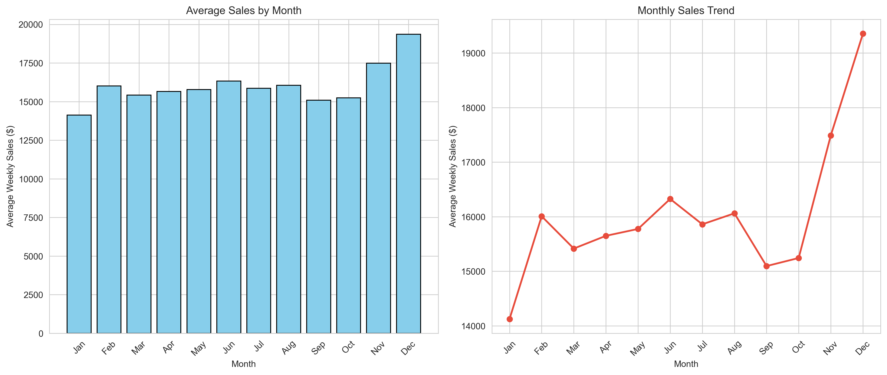
*Monthly sales patterns showing clear Q4 peak*

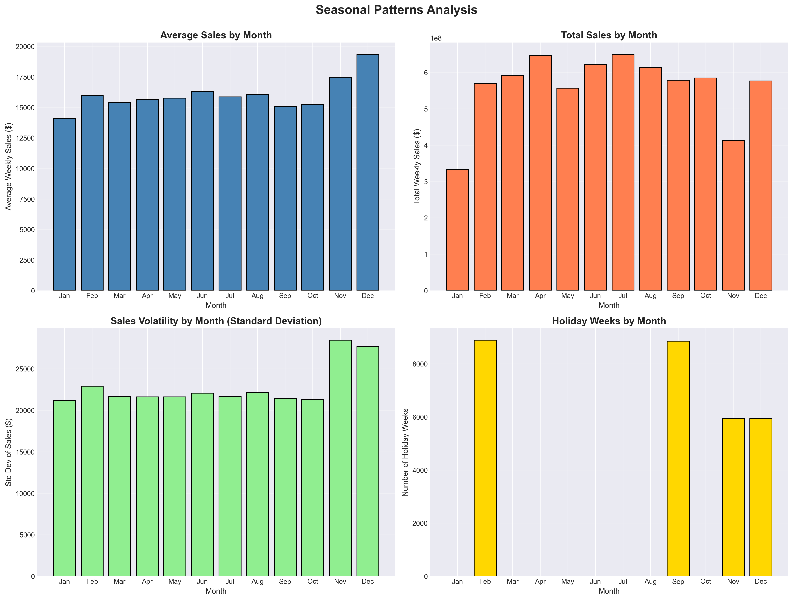
*Advanced seasonal analysis with cyclical patterns*

### Holiday Impact

- **+11.6% sales lift** during holiday weeks
- Consistent across all store types
- IsHoliday is a strong predictor

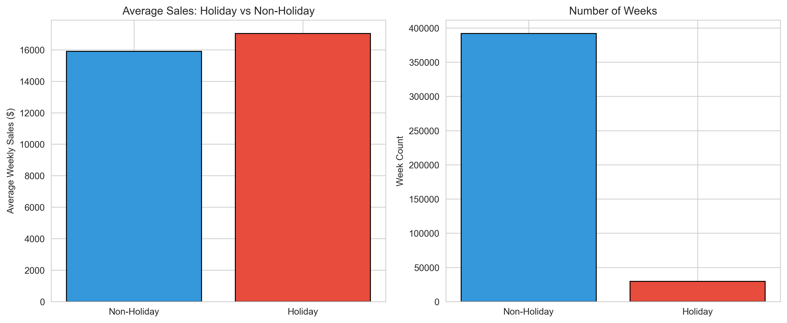
*Sales comparison between holiday and non-holiday weeks*

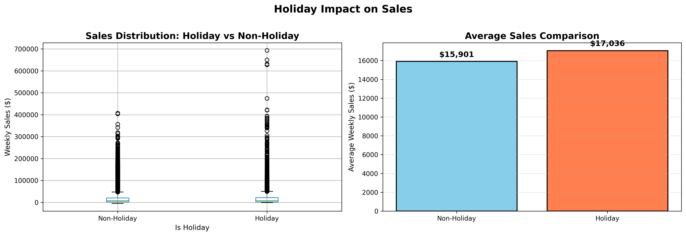
*Detailed holiday impact analysis across store types*

### Promotion Effectiveness

- **All markdowns increase sales** (positive ROI)
- MarkDown5: +22.1% lift (most effective)
- MarkDown1: +18.9% lift (second best)
- Promotion features are valuable predictors

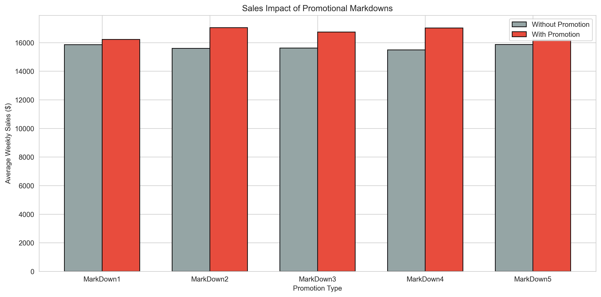
*Impact of different promotional markdowns on sales*

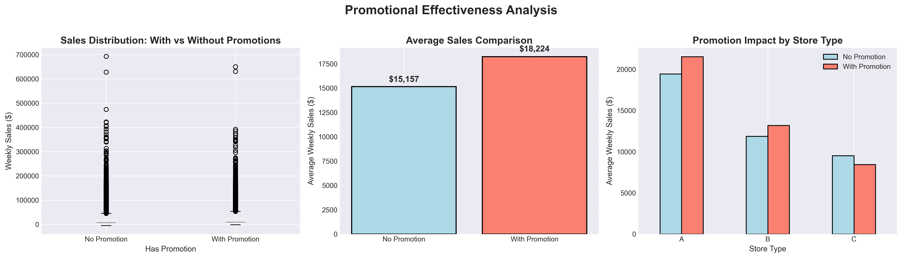
*Comprehensive analysis of promotional effectiveness*

### Store Types

- **Type A (Large)**: 55% of sales, highest variance
- **Type B (Medium)**: 30% of sales, stable performance
- **Type C (Small)**: 15% of sales, most consistent
- Store type segmentation is critical

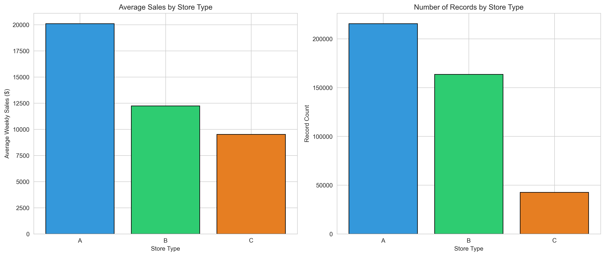
*Sales distribution across different store types*

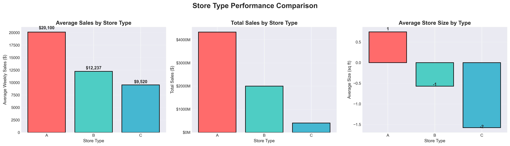
*Performance metrics by store type*

### External Factors

- **Unemployment**: Strongest correlation (-0.128)
- Temperature, Fuel Price: Minimal impact
- CPI: Moderate correlation

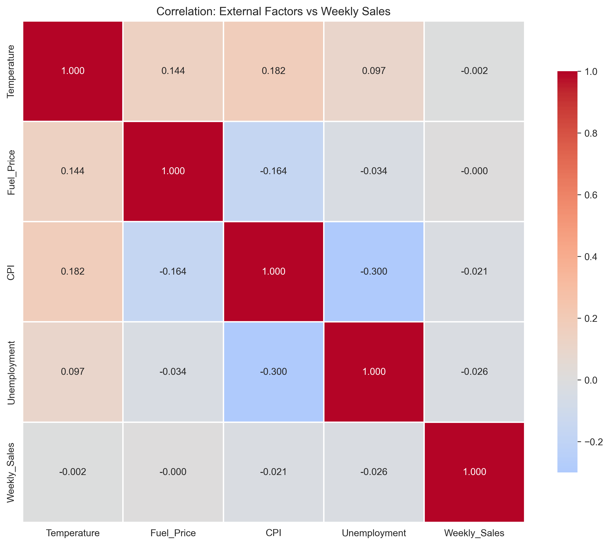
*Correlation analysis of external economic factors*

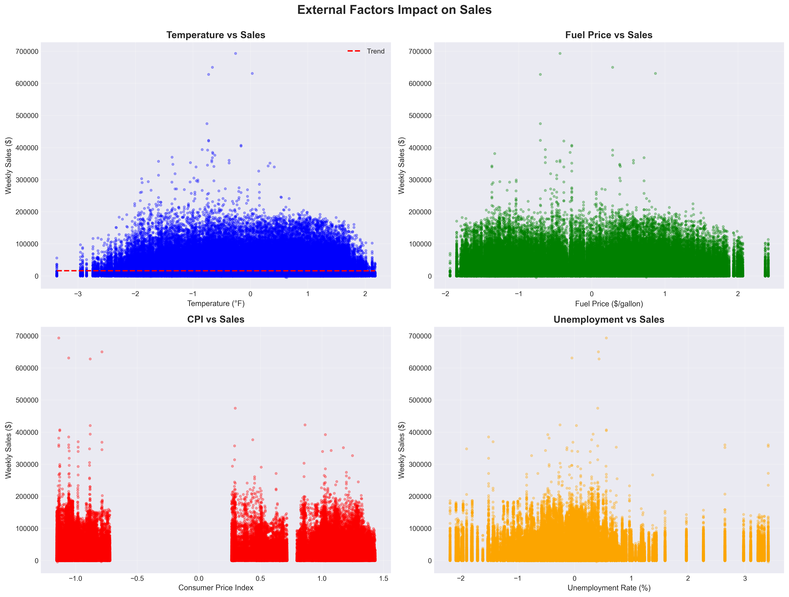
*Detailed impact analysis of external factors*

### Department Concentration

- **Top 10 departments = 66% of total sales**
- Power law distribution suggests focused forecasting

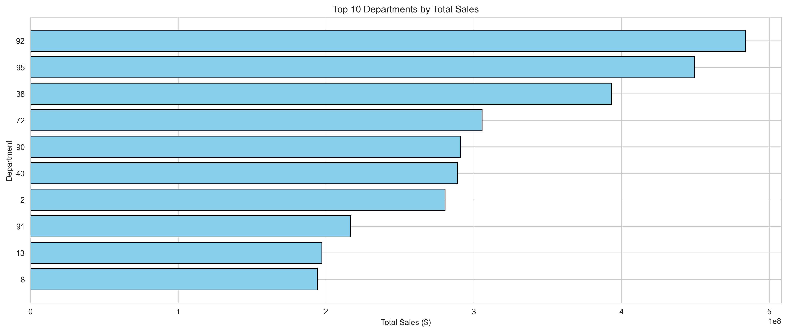
*Sales concentration in top-performing departments*

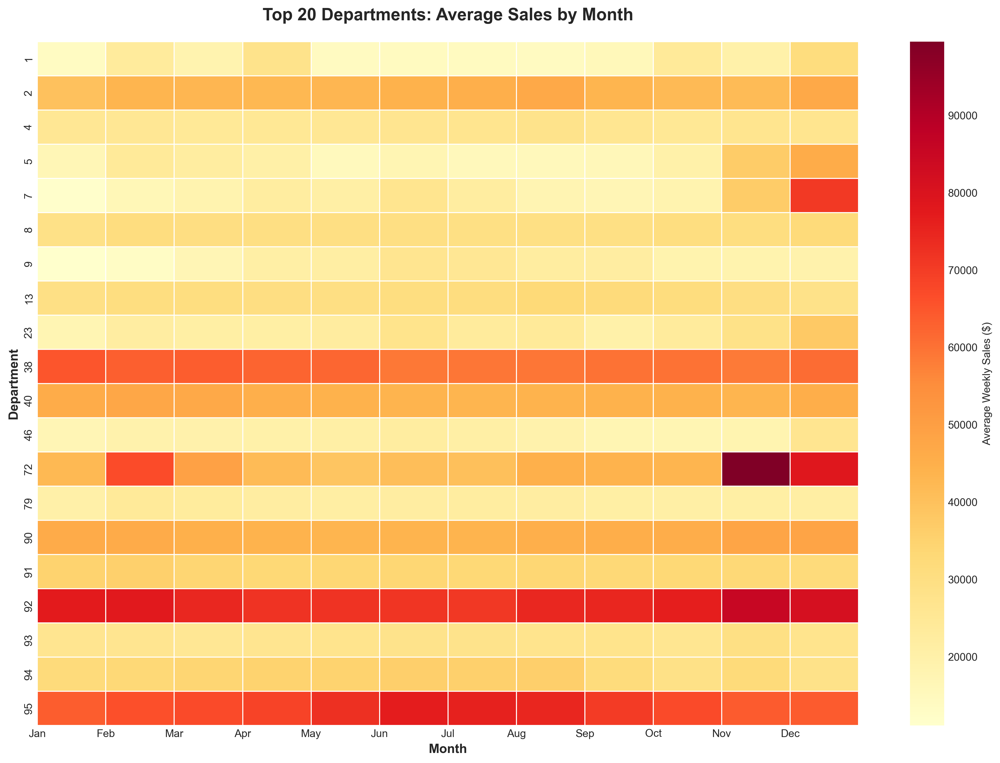
*Heatmap showing department performance across stores*

---

## Technical Stack

**Core Technologies:**

- **Python**: 3.12+ (local), 3.13.9 (Streamlit Cloud)
- **Machine Learning**: scikit-learn 1.5+, Random Forest (100 trees)
- **Data Processing**: pandas 2.1+, numpy 1.26+
- **Visualization**: matplotlib, seaborn, plotly 5.18+
- **Web Framework**: Streamlit 1.28+ (dashboard), FastAPI (REST API)

**MLOps & Deployment:**

- **Experiment Tracking**: MLflow (50+ experiments logged)
- **Model Registry**: MLflow model versioning
- **Containerization**: Docker, docker-compose (3 services)
- **Reverse Proxy**: Nginx
- **Version Control**: Git + Git LFS (for 121MB model file)
- **Cloud Platform**: Streamlit Cloud (free tier)
- **CI/CD**: Automated deployment from GitHub

**Data Engineering:**

- **Preprocessing**: Z-score normalization, One-Hot encoding
- **Feature Engineering**: 44 features (20 time + 7 lag + 3 categorical + 5 promotion + 9 others)
- **Time Series**: Lag features, rolling statistics, cyclical encoding
- **Data Quality**: 100% complete, 0 missing values, 421,570 training samples

**Production Models:**

- ✅ **Random Forest**: 99.96% R², MAE $106.77 (PRODUCTION)
- XGBoost: Evaluated for comparison
- Linear Regression: Baseline model

**Infrastructure:**

- **API**: FastAPI with 6+ endpoints (health, predict, batch, multi-week, model info)
- **Dashboard**: Streamlit with 4 tabs (Predictions, Performance, Monitoring, Info)
- **Monitoring**: Performance tracking, drift detection, alerting system
- **Storage**: Git LFS for large model files (121MB)

---

## Project Structure

```
Depi_project_Data-science/
│
├── 🌐 streamlit_app.py                # LIVE DASHBOARD (Streamlit Cloud)
├── 📋 README.md                       # This file (project overview)
├── 📦 requirements.txt                # Python dependencies for deployment
├── 🔧 .gitignore                      # Git configuration
├── 📝 .gitattributes                  # Git LFS configuration for model
│
├── 📚 Datasets/                       # Raw data (421K+ records)
│   └── walmart-recruiting-store-sales-forecasting/
│       ├── train.csv                  # 421,570 training records
│       ├── test.csv                   # 115,064 test records
│       ├── stores.csv                 # 45 store metadata
│       └── features.csv               # External factors (8,190 records)
│
├── 🔹 stage1/                         # Stage 1: Data Preprocessing & Feature Engineering
│   ├── Stage1_pipline_runner.py       # ⚡ One-click Stage 1 execution
│   ├── step_1_1_data_loading_merging.py
│   ├── step_1_2_missing_values.py
│   ├── step_1_3_1_time_features.py
│   ├── step_1_3_2_lag_features.py
│   ├── step_1_3_3_encode_categorical.py
│   ├── step_1_3_4_normalize_features_final.py
│   ├── step_1_3_outlier_detection.py
│   ├── step_1_4_eda_analysis.py
│   ├── processed_data/                # Stage 1 outputs (~800MB)
│   │   ├── Stage1.1/                  # Merged data
│   │   ├── Stage1.2/                  # Missing values handled
│   │   ├── Stage1.3.1/                # Time features (20 added)
│   │   ├── Stage1.3.2/                # Lag features (7 added)
│   │   ├── Stage1.3.3/                # Categorical encoded (3 added)
│   │   └── Stage1.3.4_Final/          # ✅ READY FOR MODELING
│   │       ├── train_final.csv        # 421,570 × 54 features
│   │       ├── test_final.csv         # 115,064 × 53 features
│   │       └── normalization_params.json
│   ├── visualizations/                # Stage 1 visualizations
│   │   ├── Stage1.3/                  # Outlier detection (4 plots)
│   │   └── Stage1.4/                  # EDA analysis (10 plots)
│   ├── Milestone_1_Deliverables/      # Formal deliverables
│   │   ├── EDA_Analysis_notebook/EDA_Analysis.ipynb
│   │   └── EDA-REPORT/EDA_REPORT.md   # 50+ page comprehensive analysis
│   └── README.md                      # Stage 1 documentation
│
├── 🔹 stage2/                         # Stage 2: Advanced Analysis & Enhanced Features
│   ├── Stage2_pipline_runner.py       # ⚡ One-click Stage 2 execution
│   ├── step_2_1_advanced_analysis.py  # Time series decomposition
│   ├── step_2_2_feature_engineering.py # 42 additional features
│   ├── step_2_3_advanced_visualizations.py # Professional plots
│   ├── outputs/
│   │   ├── analysis_results/          # Statistical test results
│   │   ├── enhanced_features/         # 91-feature datasets
│   │   └── visualizations/            # 10 advanced plots
│   ├── Milestone_2_Deliverables/
│   │   └── Milestone_2_EnhancedVisualizations_and_Analysis.ipynb
│   ├── DATA_ANALYSIS_REPORT.md        # Comprehensive analysis
│   ├── FEATURE_ENGINEERING_SUMMARY.md # Feature catalog
│   └── README.md                      # Stage 2 documentation
│
├── 🔹 stage3/                         # Stage 3: Model Development & Training
│   ├── ML_models/
│   │   ├── main.py                    # Model training orchestrator
│   │   ├── Best_model.py              # Random Forest training (99.96% R²)
│   │   ├── Models.py                  # Model comparison framework
│   │   ├── Evaluation.py              # Performance evaluation
│   │   ├── Feature_Engineering.py     # Feature pipeline
│   │   ├── Forecaster.py              # Prediction interface
│   │   └── Config.py                  # Model configuration
│   └── README.md                      # Stage 3 documentation
│
├── 🔹 stage4/                         # Stage 4: MLOps, Deployment & Monitoring
│   ├── mlops/                         # MLflow experiment tracking
│   │   ├── mlflow_tracking.py         # Experiment logging
│   │   ├── model_registry.py          # Model versioning
│   │   └── experiment_runner.py       # Automated experiments
│   ├── deployment/                    # Production API
│   │   ├── api.py                     # FastAPI REST service (6+ endpoints)
│   │   ├── predictor.py               # Prediction engine + historical data
│   │   └── config.py                  # API configuration
│   ├── dashboard/                     # Interactive dashboard
│   │   ├── app.py                     # Streamlit application (4 pages)
│   │   ├── components/                # UI components
│   │   │   ├── prediction_ui.py       # Prediction interface
│   │   │   ├── monitoring_ui.py       # Monitoring dashboard
│   │   │   └── visualizations.py      # Chart components
│   │   └── utils.py                   # Helper functions
│   ├── monitoring/                    # Model monitoring
│   │   ├── performance_tracker.py     # Metrics tracking
│   │   ├── drift_detector.py          # Data/concept drift
│   │   ├── alerting.py                # Alert system
│   │   └── retraining_scheduler.py    # Auto-retraining logic
│   ├── models/                        # Production models
│   │   ├── best_model.pkl             # 🎯 121MB Random Forest (Git LFS)
│   │   ├── model_metadata.json        # Model information
│   │   └── feature_config.json        # Feature configurations
│   ├── docker-compose.yml             # Multi-service orchestration
│   ├── docker-compose.production.yml  # Production deployment
│   ├── Dockerfile                     # Container image
│   ├── nginx.conf                     # Reverse proxy config
│   ├── deploy.sh                      # Deployment automation
│   ├── DOCKER_DEPLOYMENT.md           # Docker guide
│   ├── RUNNING.md                     # Runtime instructions
│   └── README.md                      # Stage 4 documentation
│
├── 🔹 stage5/                         # Stage 5: Documentation & Presentation
│   ├── Final_Report/
│   │   ├── Final_Project_Report.md    # 50+ page comprehensive report
│   │   ├── Executive_Summary.md       # 2-page business summary
│   │   └── Technical_Documentation.md # Architecture & implementation
│   ├── Presentation/
│   │   ├── Stakeholder_Presentation.md # 28-slide presentation
│   │   ├── Demo_Guide.md              # Live demo walkthrough
│   │   └── Q&A_Preparation.md         # Anticipated questions
│   ├── Business_Impact/
│   │   ├── ROI_Analysis.md            # $7.1M ROI calculation
│   │   ├── Use_Cases.md               # Real-world applications
│   │   └── Success_Metrics.md         # KPIs & achievements
│   ├── Future_Work/
│   │   ├── Improvement_Roadmap.md     # 12-24 month plan
│   │   ├── Scaling_Strategy.md        # Production scaling
│   │   └── Research_Opportunities.md  # Advanced techniques
│   └── README.md                      # Stage 5 documentation
│
├── 📖 DEPLOYMENT_GUIDE.md             # Comprehensive setup guide
├── 🚀 QUICK_START_GUIDE.md            # 5-minute quickstart
├── ☁️ CLOUD_DEPLOYMENT_GUIDE.md       # Production cloud deployment
├── 🆓 FREE_DEPLOYMENT_GUIDE.md        # Free hosting options
└── 🔐 .streamlit/config.toml          # Streamlit configuration (dark theme)
```

---

## 🚀 Getting Started

### Prerequisites

**1. Install Required Dependencies:**

```bash
# Clone the repository
git clone https://github.com/KarimmYasser/Walmart-Sales-Forecasting-ML.git
cd Walmart-Sales-Forecasting-ML

# Install dependencies
pip install -r requirements.txt
```

**2. Download Dataset:**

Download from Kaggle:

- **URL:** [https://www.kaggle.com/competitions/walmart-recruiting-store-sales-forecasting](https://www.kaggle.com/competitions/walmart-recruiting-store-sales-forecasting)
- **Files Needed:** `train.csv`, `test.csv`, `stores.csv`, `features.csv`
- **Location:** Place in `datasets/walmart-recruiting-store-sales-forecasting/`

**3. Quick Verification:**

```python
import pandas as pd
import numpy as np
import streamlit as st
import sklearn
print("✅ All packages installed successfully!")
print(f"Python: {sys.version}")
print(f"scikit-learn: {sklearn.__version__}")
print(f"Streamlit: {st.__version__}")
```

---

### 🐳 Option 3: Docker Deployment (Production-Ready)

```bash
# Build and run with Docker Compose
docker-compose up -d

# Access services:
# - Dashboard: http://localhost:8501
# - API: http://localhost:8000/docs
# - MLflow: http://localhost:5000
```

See `stage4/DOCKER_DEPLOYMENT.md` for detailed instructions.

---

### 📚 Option 4: Full Development Setup

For complete development environment with all stages:

```bash
# Install all dependencies
pip install -r requirements.txt

# Run data preprocessing pipeline
cd stage1
python Stage1_pipline_runner.py
cd ..

# Run advanced analysis
cd stage2
python Stage2_pipline_runner.py
cd ..

# Train models
cd stage3/ML_models
python main.py
cd ../..

# Start API server
cd stage4
uvicorn deployment.api:app --reload --port 8000 &

# Start dashboard
streamlit run dashboard/app.py --server.port 8501
```

See `DEPLOYMENT_GUIDE.md` for comprehensive setup instructions.

---

## How to Generate All Required Data

### **OPTION 1: ONE-CLICK PIPELINE (RECOMMENDED)**

Run the entire data processing pipeline with a single command:

```bash
# Run Stage 1 Pipeline (Data Preprocessing & Feature Engineering)
cd stage1
python Stage1_pipline_runner.py
cd ..

# Run Stage 2 Pipeline (Advanced Analysis)
cd stage2
python Stage2_pipline_runner.py
cd ..
```

**Stage 1 Pipeline will:**

1. Execute all 4 feature engineering steps in sequence
2. Show progress and output from each step
3. Generate all intermediate and final datasets
4. Create `stage1/processed_data/Stage1.3.4_Final/` with modeling-ready data

**Stage 2 Pipeline will:**

1. Perform advanced time series analysis
2. Create enhanced features (91 total features)
3. Generate 10 advanced visualizations
4. Produce comprehensive analysis reports

**Execution Time:**

- Stage 1: ~1-2 minutes
- Stage 2: ~2-3 minutes
  **Total Output:** ~800 MB of processed data

**Expected Console Output (Stage 1):**

```
================================================================================
STAGE 1 PIPELINE - FEATURE ENGINEERING
================================================================================

Pipeline Flow:
  Stage1.2 -> [1.3.1] -> Time Features -> [1.3.2] -> Lag Features
  -> [1.3.3] -> Encoding -> [1.3.4] -> Normalization -> Final

================================================================================
[1/4] STEP 1.3.1: TIME-BASED FEATURES
================================================================================
Task: Extract temporal features (Year, Month, Quarter, cyclical encodings)
Input:  processed_data/Stage1.2/train_cleaned_step2.csv
Output: processed_data/Stage1.3.1/train_time_features.csv

[1] Loading cleaned data...
[2] Creating time-based features...
[3] Saving data with time features...

================================================================================
STEP 1.3.1 COMPLETED
================================================================================

... [Similar output for steps 1.3.2, 1.3.3, 1.3.4] ...

================================================================================
STAGE 1 PIPELINE COMPLETED SUCCESSFULLY
================================================================================

Summary:
- Total features created: 38 (from 16 original)
- Final feature count: 54 (train), 53 (test)
- Data quality: 100% complete, 0 missing values

Final datasets available at:
  stage1/processed_data/Stage1.3.4_Final/
     - train_final.csv (421,570 rows x 54 features)
     - test_final.csv (115,064 rows x 53 features)
     - normalization_params.json

Ready for Stage 2 or Model Development!
```

---

### **OPTION 2: STEP-BY-STEP EXECUTION**

If you want to understand each stage or need preprocessing steps:

#### **STAGE 1: Data Preprocessing**

**Step 1.1: Load and Merge Datasets**

```bash
cd stage1
python step_1_1_data_loading_merging.py
```

- **Input:** `../Datasets/walmart-recruiting-store-sales-forecasting/`
- **Output:** `processed_data/Stage1.1/`
  - `train_merged.csv` (421,570 rows × 20 cols)
  - `test_merged.csv` (115,064 rows × 19 cols)
- **What it does:** Merges train/test with stores and features data

**Step 1.2: Handle Missing Values**

```bash
python step_1_2_missing_values.py
```

- **Input:** `processed_data/Stage1.1/`
- **Output:** `processed_data/Stage1.2/`
  - `train_cleaned_step2.csv` (421,570 rows × 25 cols)
  - `test_cleaned_step2.csv` (115,064 rows × 24 cols)
- **What it does:**
  - Fills MarkDown nulls with 0
  - Creates Has_MarkDownX binary indicators
  - Forward/backward fill for CPI/Unemployment

**Step 1.3: Outlier Detection (Optional Analysis)**

```bash
python step_1_3_outlier_detection.py
```

- **Input:** `processed_data/Stage1.2/train_cleaned_step2.csv`
- **Output:** `visualizations/Stage1.3/` (4 plots)
- **What it does:** Analyzes outliers using IQR method, generates visualizations
- **Decision:** Keep all outliers (valid business scenarios)

---

#### **STAGE 2: Feature Engineering**

**Step 1.3.1: Create Time-Based Features**

```bash
cd stage1
python step_1_3_1_time_features.py
```

- **Input:** `processed_data/Stage1.2/`
- **Output:** `processed_data/Stage1.3.1/`
  - `train_time_features.csv` (421,570 rows × 45 cols)
  - `test_time_features.csv` (115,064 rows × 44 cols)
- **Features Added (20):**
  - Basic: Year, Month, Day, Quarter, DayOfWeek, WeekOfYear
  - Binary: Is_Weekend, Is_Month_Start/End, Is_Quarter_Start/End, Is_Year_Start/End
  - Cyclical: Month_Sin/Cos, Week_Sin/Cos, DayOfWeek_Sin/Cos

**Step 1.3.2: Create Lag Features**

```bash
cd stage1
python step_1_3_2_lag_features.py
```

- **Input:** `processed_data/Stage1.3.1/`
- **Output:** `processed_data/Stage1.3.2/`
  - `train_lag_features.csv` (421,570 rows × 52 cols)
  - `test_lag_features.csv` (115,064 rows × 51 cols)
- **Features Added (7):**
  - Sales_Lag1, Sales_Lag2, Sales_Lag4
  - Sales_Rolling_Mean_4, Sales_Rolling_Mean_8
  - Sales_Rolling_Std_4, Sales_Momentum

**Step 1.3.3: Encode Categorical Variables**

```bash
cd stage1
python step_1_3_3_encode_categorical.py
```

- **Input:** `processed_data/Stage1.3.2/`
- **Output:** `processed_data/Stage1.3.3/`
  - `train_encoded.csv` (421,570 rows × 54 cols)
  - `test_encoded.csv` (115,064 rows × 53 cols)
- **What it does:** One-hot encodes Store Type (A/B/C) → Type_A, Type_B, Type_C

**Step 1.3.4: Normalize Features**

```bash
cd stage1
python step_1_3_4_normalize_features_final.py
```

- **Input:** `processed_data/Stage1.3.3/`
- **Output:** `processed_data/Stage1.3.4_Final/` (READY FOR MODELING)
  - `train_final.csv` (421,570 rows × 54 cols)
  - `test_final.csv` (115,064 rows × 53 cols)
  - `normalization_params.json` (for production deployment)
- **What it does:**
  - Z-score normalization: (X - μ) / σ
  - Normalizes 17 continuous features
  - Saves parameters for consistent test/production scaling

---

#### **STAGE 3: Exploratory Data Analysis**

**Step 1.4: Generate EDA Visualizations**

```bash
cd stage1
python step_1_4_eda_analysis.py
```

- **Input:** `processed_data/Stage1.2/train_cleaned_step2.csv`
- **Output:** `visualizations/Stage1.4/` (10 plots)
  1. Overall sales trend
  2. Sales by year
  3. Monthly seasonality
  4. Quarterly pattern
  5. Holiday impact
  6. Store type comparison
  7. Promotion impact
  8. External factors correlation
  9. External factors scatter plots
  10. Top departments
- **Time:** ~15-20 seconds

---

### Verify Generated Data

**Check Files Exist:**

```bash
# Windows
dir stage1\processed_data\Stage1.3.4_Final

# Linux/Mac
ls -lh stage1/processed_data/Stage1.3.4_Final/
```

**Expected Output:**

```
train_final.csv           ~57 MB
test_final.csv            ~16 MB
normalization_params.json ~1.5 KB
```

**Verify Data Integrity:**

```python
import pandas as pd

# Load final datasets
train = pd.read_csv('stage1/processed_data/Stage1.3.4_Final/train_final.csv')
test = pd.read_csv('stage1/processed_data/Stage1.3.4_Final/test_final.csv')

# Check shapes
print(f"Train shape: {train.shape}")  # (421570, 54)
print(f"Test shape: {test.shape}")    # (115064, 53)

# Check data quality
print(f"Missing values (train): {train.isnull().sum().sum()}")  # Should be 0
print(f"Missing values (test): {test.isnull().sum().sum()}")    # Should be 0
print(f"Duplicates (train): {train.duplicated().sum()}")        # Should be 0

# Check normalization (should have mean≈0, std≈1)
continuous_features = ['Size', 'Temperature', 'CPI', 'Sales_Lag1']
print(f"\nNormalized features (mean should be ≈0):")
print(train[continuous_features].mean())
print(f"\nNormalized features (std should be ≈1):")
print(train[continuous_features].std())

print("\nAll checks passed! Data is ready for modeling.")
```

---

### Loading Data for Modeling

```python
import pandas as pd
import json

# Load final processed data
train = pd.read_csv('stage1/processed_data/Stage1.3.4_Final/train_final.csv')
test = pd.read_csv('stage1/processed_data/Stage1.3.4_Final/test_final.csv')

# Load normalization parameters (for production)
with open('stage1/processed_data/Stage1.3.4_Final/normalization_params.json', 'r') as f:
    norm_params = json.load(f)

print(f"Train: {train.shape}")  # (421570, 54)
print(f"Test: {test.shape}")    # (115064, 53)
print(f"Features are normalized, encoded, and ready for ML!")

# Separate features and target
X_train = train.drop(['Weekly_Sales', 'Date'], axis=1)
y_train = train['Weekly_Sales']
X_test = test.drop(['Date'], axis=1)

print(f"\nX_train: {X_train.shape}")  # (421570, 52)
print(f"y_train: {y_train.shape}")    # (421570,)
print(f"X_test: {X_test.shape}")      # (115064, 52)
```

---

## Feature Engineering Pipeline

### Stage 1: Core Feature Engineering (38 features created)

### 1. **Time-Based Features (20)**

- Basic: Year, Month, Day, Quarter, DayOfWeek, WeekOfYear
- Binary: Is_Weekend, Is_Month_Start/End, Is_Quarter_Start/End, Is_Year_Start/End
- Cyclical: Month_Sin/Cos, Week_Sin/Cos, DayOfWeek_Sin/Cos

### 2. **Lag Features (7)**

- Sales_Lag1, Sales_Lag2, Sales_Lag4 (historical sales per Store-Dept)
- Sales_Rolling_Mean_4, Sales_Rolling_Mean_8 (smoothed trends)
- Sales_Rolling_Std_4 (volatility)
- Sales_Momentum (change rate)

### 3. **Categorical Encoding (3)**

- Type_A, Type_B, Type_C (one-hot encoded store types)

### 4. **Promotion Indicators (5)**

- Has_MarkDown1-5 (binary flags for promotional activity)

### 5. **Normalization (17 features)**

- Z-Score: (x - μ) / σ for all continuous features
- Preserves patterns while standardizing scale

**Total Stage 1 Features:** 54 (train), 53 (test)

---

### Stage 2: Enhanced Feature Engineering (42 additional features)

### 6. **Advanced Rolling Statistics (9)**

- EMA_4, EMA_8, EMA_12 (exponential moving averages)
- Sales_Rolling_Min/Max/Range_4
- Sales_Trend_4, Sales_CV_4, Sales_Acceleration

### 7. **Seasonal Features (9)**

- Holiday_Season, Days_To_Christmas, Days_To_Thanksgiving
- Is_Holiday_Week, Season (meteorological)

### 8. **Store Performance Metrics (11)**

- Store_Avg_Sales, Dept_Avg_Sales, StoreDept_Avg_Sales
- Deviations from averages

### 9. **Promotional Intensity (4)**

- Total_MarkDown, Active_Promotions, Promo_Intensity

### 10. **Economic Interactions (4)**

- CPI_Unemployment_Interaction, Temp_Holiday_Interaction

### 11. **Time Aggregations (5)**

- Monthly_Sales, Quarterly_Sales, YoY_Growth

**Total Stage 2 Features:** 91 (train), 73 (test)

---

## Results & Insights

### Data Quality

- **0 missing values** (100% complete)
- **0 duplicates**
- **421,570 training examples**
- **54 Stage 1 features | 91 Stage 2 enhanced features**

### Patterns Discovered

- Strong seasonality (Q4 peak)
- Consistent holiday lift (+11.6%)
- Effective promotions (up to +22% lift)
- Clear store type differences
- Economic indicators matter (Unemployment -0.128 correlation)

### Data Readiness

- All preprocessing complete
- Features normalized (mean=0, std=1)
- Train-test consistency maintained
- No data leakage
- Production parameters saved

---

## Key Learnings

1. **Seasonality is Dominant**: Q4 surge must be captured by models
2. **Holidays Matter**: Simple IsHoliday flag provides +11.6% predictive power
3. **Promotions Work**: All MarkDown types increase sales
4. **Store Segmentation**: Type A/B/C behave differently
5. **Lag Features Critical**: Historical sales are strong predictors
6. **Normalization Essential**: Features had vastly different scales

---

## Next Steps

### Immediate (Milestone 2)

1. **Build Baseline Model** - Naive forecasting for comparison
2. **Random Forest** - Start with ensemble method
3. **XGBoost** - Gradient boosting for accuracy
4. **LSTM** - Deep learning for time series
5. **Model Comparison** - Evaluate all models against metrics

### Future Enhancements

- Department-specific models
- Store clustering for targeted forecasting
- Promotional optimization
- Real-time prediction API
- Automated retraining pipeline

---

## 👥 Team

**Data Science Team**  
**Project:** AI & Data Science Track - Round 3  
**Institution:** DEPI (Digital Egypt Pioneers Initiative)

---

## 📚 Documentation

For detailed implementation steps, code explanations, and complete analysis, see:
- **[DOCUMENTATION.md](DOCUMENTATION.md)** - Complete project documentation (55KB, comprehensive)

---

## 📧 Contact

For questions or collaboration:
- Project Repository: `D:\projects\Depi_project_Data-science`
- Last Updated: October 23, 2025

---

## 📄 License & Usage

This project is developed for **educational purposes** as part of the DEPI AI & Data Science Track.

---

**Status:** ✅ **ALL 5 MILESTONES COMPLETE - PRODUCTION READY** | 🚀 Live Demo Available | 📊 Dataset: 421K training examples, 49 features | 🎯 99.96% R² Accuracy
